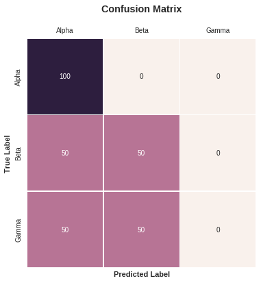

# bblearn

> Machine learning made easier, at least for me. - kenoph

`bblearn` is a small collection of reusable pieces of code that I used in my Machine Learning experiments.

# Examples

## Confusion Matrix Plot


```python
from bblearn import viz
from matplotlib import pyplot as plt
%matplotlib inline
import numpy as np

viz.confusion_matrix(ytrue=[0, 1, 2, 0, 1, 2],
                     ypred=[0, 0, 1, 0, 1, 0], labels=["Alpha", "Beta", "Gamma"], size=6)
```




